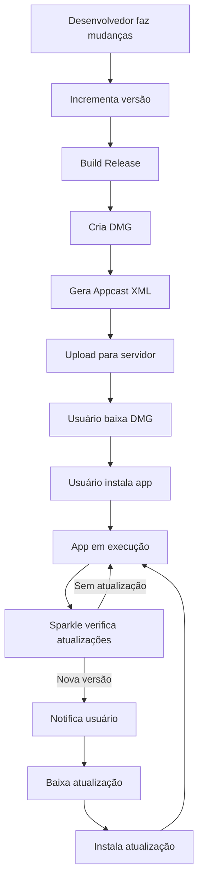
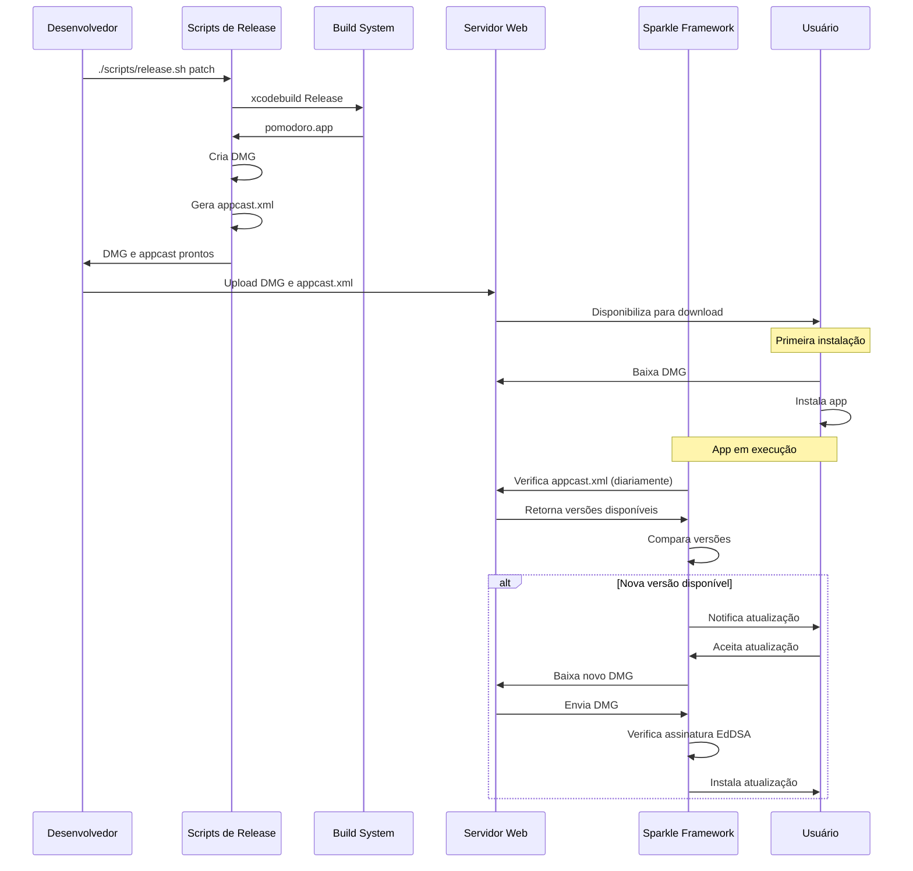

# Ciclo Completo de Distribuição e Atualizações

Este documento explica o ciclo completo de distribuição do app Pomodoro, desde a primeira instalação até as atualizações automáticas.

## Visão Geral do Fluxo

O ciclo completo envolve:

1. **Desenvolvimento**: Código, testes, versionamento
2. **Build e Empacotamento**: Compilação em Release, criação do DMG
3. **Distribuição Inicial**: Disponibilizar DMG para download
4. **Instalação pelo Usuário**: Download e instalação do DMG
5. **Atualizações Automáticas**: Sistema Sparkle para manter usuários atualizados

## Diagrama do Fluxo Completo



## Fase 1: Primeira Distribuição (Instalação Inicial)

### Passo 1: Preparar o Release

```bash
# 1. Incrementar versão (patch para correções, minor para features, major para breaking changes)
./scripts/release.sh patch

# Ou manualmente:
./scripts/increment-version.sh patch
./scripts/create-dmg.sh
```

O script `release.sh` faz automaticamente:

- Incrementa a versão no `project.pbxproj`
- Faz build em modo Release
- Cria o DMG em `build/Pomodoro-X.X.dmg`
- Cria tag Git (opcional)
- Gera appcast se `APPCAST_URL_BASE` estiver configurado

### Passo 2: Criar o DMG

O DMG é criado automaticamente pelo script, contendo:

- O app `pomodoro.app`
- Um atalho para `/Applications`

**Localização**: `build/Pomodoro-X.X.dmg`

### Passo 3: Hospedar o DMG

Você precisa disponibilizar o DMG em um servidor web. Opções:

#### Opção A: GitHub Releases (Recomendado para começar)

1. Crie um release no GitHub
2. Faça upload do DMG
3. Usuários baixam diretamente do GitHub

**Vantagens**: Gratuito, fácil, integrado com Git

**Desvantagens**: Não suporta atualizações automáticas facilmente

#### Opção B: Servidor Próprio

1. Configure um servidor web (Apache, Nginx, etc.)
2. Faça upload do DMG para `https://seu-dominio.com/releases/`
3. Configure HTTPS (obrigatório para Sparkle)

**Vantagens**: Controle total, suporta atualizações automáticas

**Desvantagens**: Requer servidor próprio

#### Opção C: Serviços de CDN

- AWS S3 + CloudFront
- Cloudflare Pages
- Netlify
- Vercel

### Passo 4: Usuário Instala o App

1. Usuário baixa o DMG do seu servidor
2. Abre o DMG (pode precisar clicar com botão direito → Abrir se não assinado)
3. Arrasta o app para a pasta Aplicativos
4. Executa o app pela primeira vez

**Nota**: Se o app não estiver assinado/notarizado, o macOS pode mostrar avisos de segurança.

## Fase 2: Configurar Atualizações Automáticas

Para que os usuários recebam atualizações automaticamente, você precisa configurar o Sparkle.

### Passo 1: Adicionar Sparkle ao Projeto

No Xcode:

1. **File → Add Package Dependencies...**
2. URL: `https://github.com/sparkle-project/Sparkle`
3. Adicionar ao target `pomodoro`

O app já tem `UpdateManager.swift` e `UpdateSettingsSection.swift` prontos!

### Passo 2: Gerar Chaves de Assinatura EdDSA

```bash
# Gerar chaves (execute uma vez)
./scripts/generate-keys.sh
```

Isso gera:

- `eddsa_private_key.pem` (MANTENHA PRIVADO! Usado para assinar releases)
- `eddsa_public_key.pem` (adicione ao Info.plist)

### Passo 3: Configurar Info.plist

Adicione ao `Info.plist` do app:

```xml
<key>SUFeedURL</key>
<string>https://seu-dominio.com/releases/appcast.xml</string>

<key>SUPublicEDKey</key>
<string>SUA_CHAVE_PUBLICA_EDDSA_AQUI</string>
```

### Passo 4: Configurar Servidor para Appcast

O appcast é um feed RSS XML que o Sparkle consulta para verificar atualizações.

## Fase 3: Processo de Atualização

### Para o Desenvolvedor: Fazer um Novo Release

```bash
# 1. Configurar URL base do appcast
export APPCAST_URL_BASE=https://seu-dominio.com/releases

# 2. Fazer release (gera DMG e appcast automaticamente)
./scripts/release.sh patch

# 3. Assinar o DMG com EdDSA
./scripts/sign-dmg.sh build/Pomodoro-X.X.dmg

# 4. Fazer upload:
#    - DMG: build/Pomodoro-X.X.dmg → https://seu-dominio.com/releases/
#    - Appcast: releases/appcast.xml → https://seu-dominio.com/releases/appcast.xml
```

### Para o Usuário: Receber Atualizações

1. **Verificação Automática**: O Sparkle verifica atualizações diariamente
2. **Notificação**: Se houver nova versão, o usuário é notificado
3. **Download**: O usuário pode baixar e instalar diretamente do app
4. **Instalação**: O Sparkle gerencia todo o processo

O usuário também pode verificar manualmente:

- **Settings → Updates → Check for Updates**

## Estrutura de Arquivos no Servidor

```
https://seu-dominio.com/releases/
├── appcast.xml              # Feed de atualizações (Sparkle consulta isso)
├── Pomodoro-1.0.dmg         # Versão inicial
├── Pomodoro-1.1.dmg         # Atualização 1
├── Pomodoro-1.2.dmg         # Atualização 2
└── ...
```

## Fluxo Detalhado: Do Código ao Usuário



## Segurança

### Assinatura EdDSA

- **Chave Privada**: Usada para assinar cada DMG (mantenha segura!)
- **Chave Pública**: Incluída no Info.plist do app
- O Sparkle verifica a assinatura antes de instalar

### HTTPS Obrigatório

- Appcast e DMGs devem ser servidos via HTTPS
- Sparkle não aceita HTTP por segurança

### Notarização (Opcional mas Recomendado)

Para melhor experiência do usuário:

1. Assine o app com Developer ID
2. Notarize com Apple
3. Usuários não precisarão desabilitar Gatekeeper

## Checklist Completo

### Setup Inicial (Uma Vez)

- [ ] Adicionar Sparkle ao projeto Xcode
- [ ] Gerar chaves EdDSA (`generate-keys.sh`)
- [ ] Configurar `SUFeedURL` no Info.plist
- [ ] Configurar `SUPublicEDKey` no Info.plist
- [ ] Configurar servidor web com HTTPS
- [ ] Testar instalação inicial

### Para Cada Release

- [ ] Fazer mudanças no código
- [ ] Testar localmente
- [ ] Executar `./scripts/release.sh [patch|minor|major]`
- [ ] Revisar DMG gerado
- [ ] Assinar DMG com EdDSA (se configurado)
- [ ] Fazer upload do DMG para servidor
- [ ] Fazer upload do appcast.xml atualizado
- [ ] Testar atualização em versão antiga do app
- [ ] Criar tag Git (se não usar --skip-git)
- [ ] Push da tag (se necessário)

## Troubleshooting

### Usuário não consegue instalar DMG

- **Gatekeeper bloqueando**: App não assinado/notarizado
  - Solução: Assinar com Developer ID e notarizar
  - Workaround: Usuário clica com botão direito → Abrir

### Atualizações não aparecem

1. Verificar `SUFeedURL` no Info.plist
2. Verificar se appcast está acessível via HTTPS
3. Verificar se versão no appcast é maior que a atual
4. Verificar logs do console

### Erro de Assinatura

1. Verificar `SUPublicEDKey` no Info.plist
2. Verificar se DMG foi assinado com chave privada correspondente
3. Regenerar chaves se necessário

## Scripts Disponíveis

| Script | Função |
|--------|--------|
| `get-version.sh` | Ver versão atual |
| `increment-version.sh` | Incrementar versão (patch/minor/major) |
| `create-dmg.sh` | Criar DMG do app |
| `generate-appcast.sh` | Gerar/atualizar appcast.xml |
| `release.sh` | Release completo (versão + build + DMG + appcast) |
| `generate-keys.sh` | Gerar chaves EdDSA |
| `sign-dmg.sh` | Assinar DMG com EdDSA |

## Próximos Passos Recomendados

1. **Criar scripts faltantes**:
   - `scripts/generate-keys.sh` para gerar chaves EdDSA
   - `scripts/sign-dmg.sh` para assinar DMGs

2. **Configurar servidor**:
   - Escolher hospedagem (GitHub Releases, servidor próprio, CDN)
   - Configurar HTTPS
   - Fazer primeiro upload

3. **Adicionar Sparkle ao projeto**:
   - Via Swift Package Manager
   - Configurar Info.plist

4. **Testar ciclo completo**:
   - Fazer release de teste
   - Instalar versão antiga
   - Verificar se atualização funciona

5. **Assinatura e Notarização** (opcional):
   - Obter Developer ID da Apple
   - Assinar app e DMG
   - Notarizar com Apple

## Referências

- [DMG.md](DMG.md): Como criar DMG
- [RELEASES.md](RELEASES.md): Processo de releases
- [UPDATES.md](UPDATES.md): Configuração do Sparkle
- [Sparkle Documentation](https://sparkle-project.org/documentation/)
- [Apple Code Signing](https://developer.apple.com/documentation/security/notarizing_macos_software_before_distribution)
