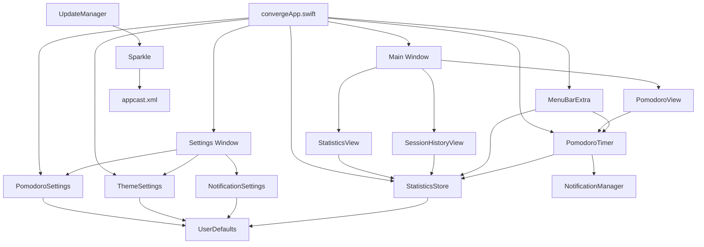

# Architecture

Converge is a single native macOS app. The app target is managed by `converge.xcodeproj`; `Package.swift` exists only to centralize the Sparkle dependency through `Sources/ConvergeDependencies/`.

## High-Level Structure

- `converge/convergeApp.swift` defines the SwiftUI `@main` app, the main window, settings window, menu bar extra, app commands, and shared environment objects.
- `converge/Models/` contains Pomodoro settings, notification settings, theme selection, phase colors, and completed session records.
- `converge/Services/` contains the timer engine, local statistics store, notification manager, window helpers, compact/fullscreen behavior, window observer, and Sparkle update manager.
- `converge/Views/` contains the Pomodoro, statistics, history, settings, menu bar, welcome, visual effect, and reusable control views.
- `convergeTests/` and `convergeUITests/` define the current unit and UI test targets.

## App Composition

`converge/convergeApp.swift` creates the app-wide state:

- `PomodoroSettings` owns work, short break, long break, long-break interval, and auto-continue preferences.
- `PomodoroTimer` receives `PomodoroSettings` and owns timer phase, remaining seconds, progress, running state, completed count, and manual-next-phase state.
- `ThemeSettings` owns light, dark, or system appearance behavior.
- `StatisticsStore.shared` owns completed session history and derived counters.

These objects are passed into the main window, settings window, and menu bar content with SwiftUI environment objects.

## Main User Flow

The main window shows a tabbed interface:

- `PomodoroView` renders the current phase, circular progress, remaining time, start/pause/reset controls, and manual next-phase controls.
- `StatisticsView` renders today, week, and month counters plus a 14-day chart using Swift Charts.
- `SessionHistoryView` filters and groups completed sessions by today, this week, this month, or all time.

The settings window exposes timer durations, auto-continue, appearance, notification settings, sound settings, update checks, reset-to-defaults, and clear-history actions.

The menu bar extra uses the formatted timer as its label and provides quick timer, statistics summary, window, settings, update, and quit actions.

## Timer Flow

`PomodoroTimer` uses Combine's `Timer.publish(every:on:in:)` to tick once per second on the main run loop.

When a work phase completes:

1. `NotificationManager.shared.sendWorkCompleteNotification()` is called.
2. `StatisticsStore.shared.recordCompletedPomodoro(durationSeconds:)` stores a completed session.
3. `completedPomodoros` increments.
4. The next break length is selected from `PomodoroSettings`.

When a break phase completes:

1. `NotificationManager.shared.sendBreakCompleteNotification()` is called.
2. The phase returns to work.
3. The timer either continues or pauses depending on `autoContinue`.

Manual mode sets `isWaitingForManualStart` and waits for the user to start the next phase.

## Persistence

Converge does not use a database or ORM. Runtime data is local and stored in `UserDefaults`.

| Data | Owner | Storage |
| --- | --- | --- |
| Timer durations, long-break interval, auto-continue | `PomodoroSettings` | Individual `UserDefaults` keys |
| Notification and sound preferences | `NotificationSettings` | `@AppStorage` keys |
| Theme selection | `ThemeSettings` | `selectedTheme` key |
| Welcome modal state | `convergeApp.swift` | `@AppStorage("hasSeenWelcomeModal")` |
| Completed sessions | `StatisticsStore` | JSON-encoded `[PomodoroSession]` under `pomodoro_sessions` |

`StatisticsStore` trims history to the 500 most recent completed sessions.

## Notifications and Sound

`NotificationManager` requests notification authorization during app initialization. It uses `UNUserNotificationCenter` to send immediate work-complete and break-complete notifications.

Sounds are played manually with `NSSound` based on `NotificationSettings`. The notification delegate asks macOS to present banners even when the app window is active, without using the notification sound channel.

## Windows and Menu Bar

The app defines:

- `WindowGroup(id: "main")` for the main app window.
- `Window("Converge Settings", id: "converge-settings")` for settings.
- `MenuBarExtra` with the timer label and quick actions.

`WindowManager` and `MenuBarContent` activate the app, find existing windows, and avoid opening duplicate settings windows when possible.

`CompactWindowService` can reset the key window to a 400 by 500 content size, zoom the window, or toggle native fullscreen.

`GlassEffect.swift` bridges `NSVisualEffectView` and configures transparent, movable, material-backed macOS windows.

## Updates

Sparkle is the update mechanism.

- `Package.swift` and the Xcode project depend on Sparkle 2.8.1.
- `converge/Info.plist` contains `SUFeedURL` and `SUPublicEDKey`.
- `UpdateManager` creates `SPUStandardUpdaterController`, sets a daily update interval, exposes manual update checks, and returns the appcast URL.
- `appcast.xml` stores Sparkle release metadata.
- `.github/workflows/release.yml` updates the appcast and publishes it through GitHub Pages during the manual release workflow.

## Data Flow Diagram

## Current Limitations

- The app target requires macOS 26.0 according to the Xcode target configuration, while `Package.swift` declares macOS 11 only for dependency management.
- The current unit test target appears stale because it calls `PomodoroTimer()` even though the implementation currently requires `PomodoroTimer(settings:)`.
- The release configuration references `polterware/converge`, while this checkout's Git remote points to `rckbrcls/converge`. Release ownership should be verified before publishing.
